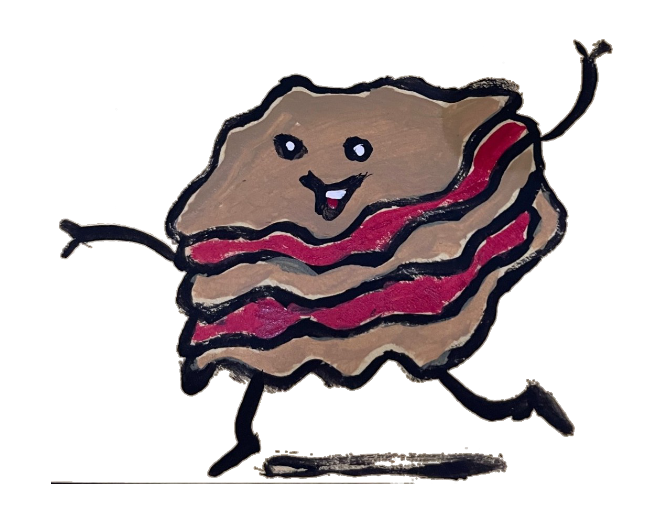

# Baby Lasagna User Manual
### Authors/Developers: Michael Ballard, Brian Leitch, Evan Osterberg, Maddison Winters

## What is Baby Lasagna?
Baby Lasagna is a level-based puzzle platformer.  
The goal is to make your way to an exit door without falling apart.  
Taking damage will cause Baby Lasagna to lose some of their lasagna layers.  
Baby Lasagna dies if too many layers are lost.  

## Main Menu
Click the X button to exit the game  
Click "Level 1" or "Level 2" to load the corresponding level  

## Pause Menu
Click "Resume" to resume the level  
Click "Restart" to restart the level  
Click "Exit" to exit the level and return to the main menu  

## Controls
Left: A or Left Arrow  
Right: D or Right Arrow  
Jump: Space, W, or Up Arrow  
Fast-Fall: S or Down Arrow  
Pause Menu: Escape  
Use Ability: Q  

## Win/Lose
To win, find and touch a black and gold door  
Making contact with pasta-spikes will cause you to lose one layer every 0.8s  
Upon losing all layers, you immediate die and therefore lose  

## Abilities
Using an ability consumes the top layer of Baby Lasagna  
If the top layer is Cheese, you sling a glob of cheese that will "splat" onto a wall. You can stick onto and jump off of this "splat"  
If the top layer is Meat, you place a chunk of meat in front of you. This chunk will remain their permanently and can be stood on  
If the top layer is anything else, no ability is used, and the top layer is simply discarded  
